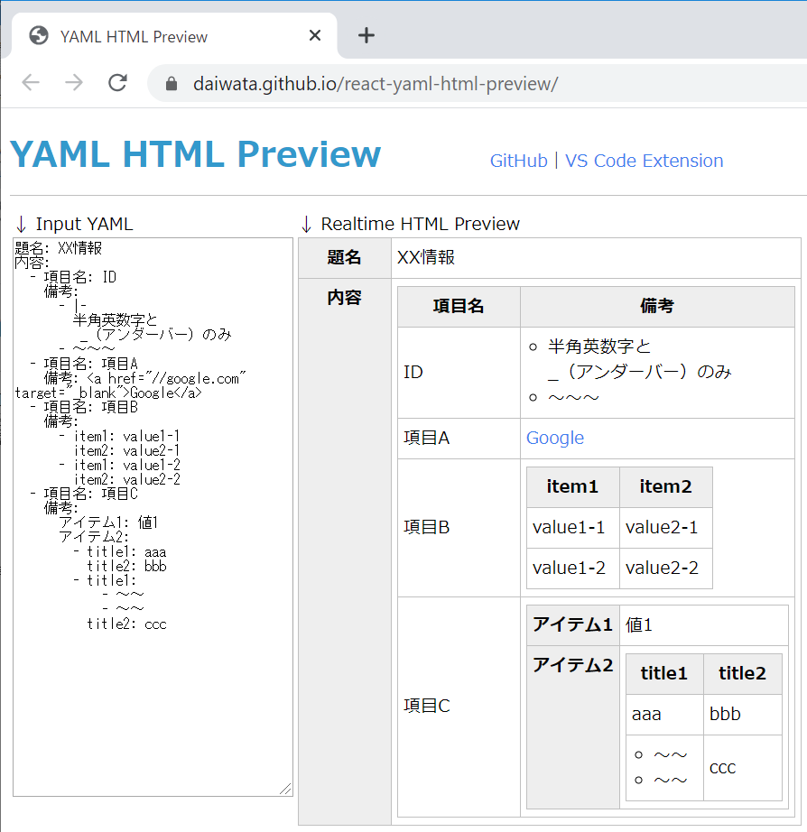

# YAML HTML Preview

YAML を入力すると、リアルタイムにHTMLの table 形式でプレビューすることができます。

Webサービスとして公開しています。(GitHub Pages)
- [YAML HTML Preview - github pages](https://daiwata.github.io/react-yaml-html-preview/)

  
<br>

## ◆特徴

- YAML で記述されたファイルの構造を分かりやすく描画できます。
- 記述した YAML が意図した構造になっているかを確認できます。
- Hash の List を一覧表形式で表現できます。  
<br>


## ◆描画仕様

### ◎Hash

Hash の部分は、左にキー、右に値を持つテーブルとして描画されます。

例）
```YAML
item1: value1
item2: value2
```
描画イメージ
<table>
<tr><th>item1</th><td>value1</td></tr>
<tr><th>item2</th><td>value2</td></tr>
</table>
<br>

### ◎HashのList

Hash の List になっている部分は、一覧表形式で描画されます。

例）
```YAML
- item1: value1-1
  item2: value2-1
- item1: value1-2
  item2: value2-2
```
描画イメージ
| item1    | item2    |
| -------- | -------- |
| value1-1 | value1-2 |
| value2-1 | value2-2 |
<br>

## ◆注意事項

YAML の形式が正しくない場合は、HTMLは描画されません。  
<br>

## ◆ローカルでの使用方法

React で作成していますので、npm の知識があれば  
Clone してローカルで使用することができます。

↓ Clone して、ローカルで動作させるまでのコマンド例です。
```
git clone https://github.com/daiwata/react-yaml-html-preview
cd react-yaml-html-preview
npm install
npm start
```
⇒ `http://localhost:3000/` で起動します。

※ ローカルの場合、Internet Explorer では動作しません。  
<br>

## ◆ライセンス

MIT